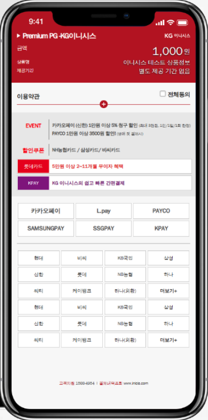

# PG 일반결제
Iamport 서비스를 활용한 inisis 일반 결제 기능입니다.   

Iamport 서비스를 이용하기 위해서는 계약이 필요합니다.   

이 과정에서 심사가 있고, 적절한 준비가 되어야 일반 결제를 사용할 수 있습니다.

## PG 일반결제 화면

### 폴더 구조
clean architecture 구조 적용으로 확장성, 호환성 높은 구조입니다.

## 기타